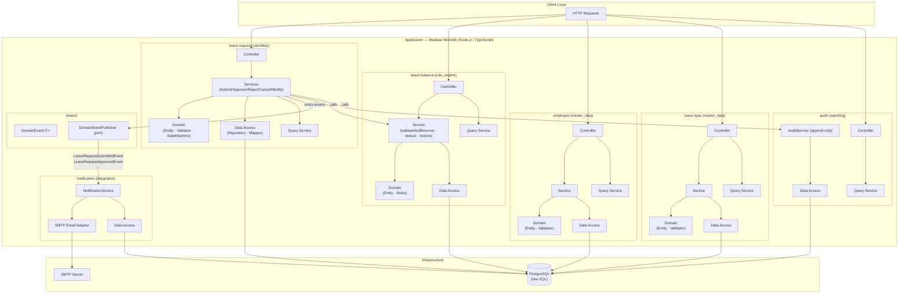

# Architecture Diagram

> Derived from `design/application_architecture.json` v1.0

## System Overview

The Leave Management System is a **modular monolith** following a **layered, workflow-driven** architecture with **event-driven notifications**.

## Layer Responsibilities

| Layer | Responsibility |
|---|---|
| **controller** | HTTP entry point — validate request shape, delegate to service (writes) or query_service (reads) |
| **service** | Write use-case orchestration — authorize, load entity, apply domain behaviour, save, emit event |
| **query_service** | Read-only projections — stateless, bypasses domain layer, returns ReadDto from data_access |
| **domain** | Business invariants and state machine — Entity, Validator, StateMachine, Rules |
| **data_access** | Persistence — Repository interface (port), Repository impl (raw SQL), Mapper (row ↔ entity) |
| **dto** | Typed contracts — Commands (write inputs), ResponseDto, ReadDto, Events |

## Tech Stack

| Concern | Choice |
|---|---|
| Language | TypeScript |
| Runtime | Node.js |
| Database | PostgreSQL |
| Data Access | Raw SQL (no ORM) |
| Package Manager | npm |
