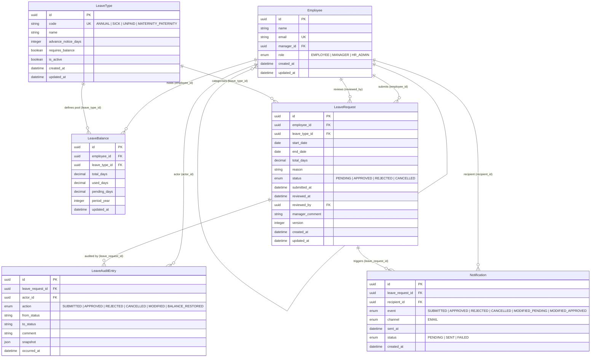

# Entity Relationship Diagram

> Derived from `ba/data-model/logical-data-model.json` v1.0

## Module Ownership

| Entity | Module |
|---|---|
| Employee | employee |
| LeaveType | leave-type |
| LeaveBalance | leave-balance |
| LeaveRequest | leave-request |
| LeaveAuditEntry | audit |
| Notification | notification |

## Key Constraints

- `LeaveBalance` has a composite unique constraint on `(employee_id, leave_type_id, period_year)`
- `LeaveAuditEntry` is append-only — rows are never updated or deleted
- `Employee.manager_id` is NULL for top-level employees and HR Admins
