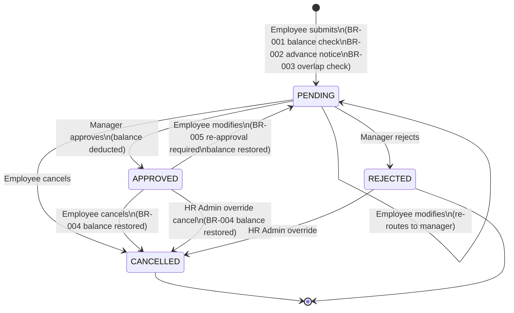
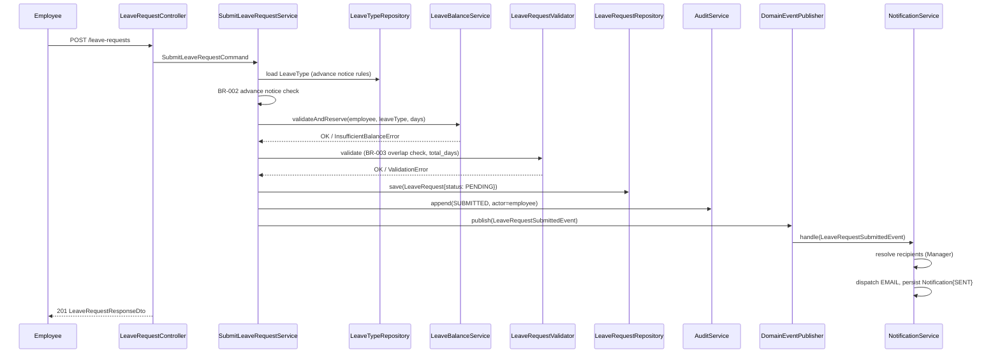
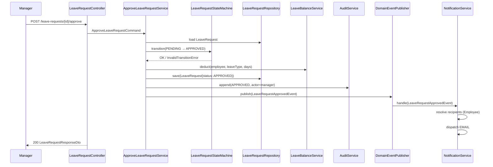
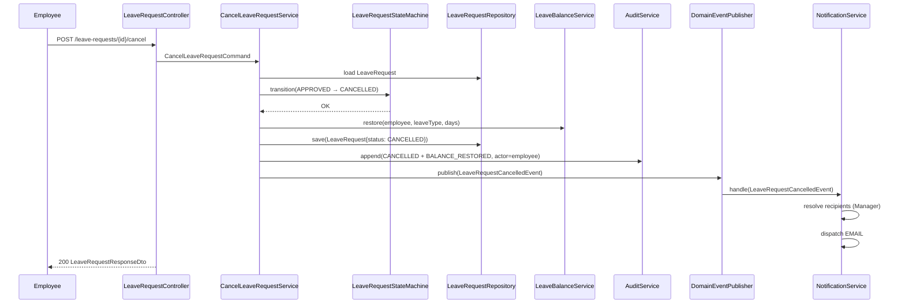

# Leave Request Workflow & Data Flow Diagram

> Derived from `design/modules/module-catalog.json` — MOD-004 state machine and `design/application_architecture.json` business rule classification

## State Machine

## Submit Leave Request — Data Flow

## Approve Leave Request — Data Flow

## Cancel Approved Leave — Data Flow (BR-004)

## Business Rules Summary

| Rule | Layer | Artifact | Module |
|---|---|---|---|
| BR-001 Balance must cover requested days | domain | `LeaveBalanceRules` | leave-balance |
| BR-002 Advance notice per leave type | service | `SubmitLeaveRequestService` | leave-request |
| BR-003 No overlapping PENDING/APPROVED requests | domain | `LeaveRequestValidator` | leave-request |
| BR-004 Cancellation of APPROVED restores balance | service | `CancelLeaveRequestService` | leave-request |
| BR-005 Modification of APPROVED requires re-approval | domain | `LeaveRequestStateMachine` | leave-request |
