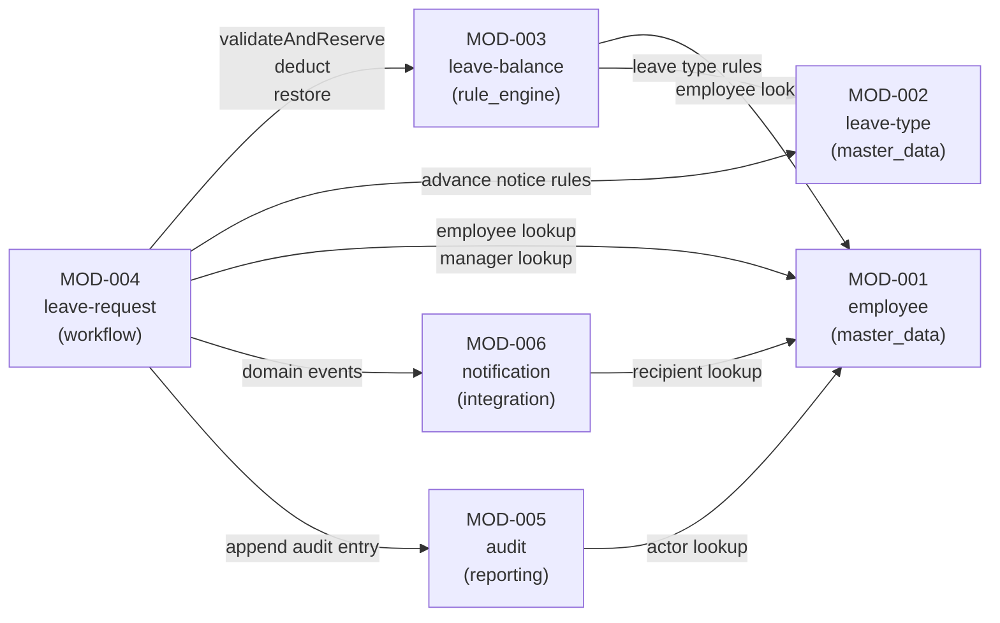

# Module Interaction Diagram

> Derived from `design/application_architecture.json` and `design/modules/module-catalog.json`

## Module Dependency Graph

## API Endpoints by Module

| Module | Endpoints |
|---|---|
| **employee** | `GET /employees` · `GET /employees/{id}` · `POST /employees` · `PUT /employees/{id}` · `GET /employees/{id}/direct-reports` |
| **leave-type** | `GET /leave-types` · `GET /leave-types/{id}` · `POST /leave-types` · `PUT /leave-types/{id}` · `DELETE /leave-types/{id}` |
| **leave-balance** | `GET /employees/{id}/balances` · `GET /employees/{id}/balances/{leaveTypeId}` · `PUT /employees/{id}/balances/{leaveTypeId}` |
| **leave-request** | `POST /leave-requests` · `GET /leave-requests` · `GET /leave-requests/{id}` · `PUT /leave-requests/{id}` · `POST /leave-requests/{id}/approve` · `POST /leave-requests/{id}/reject` · `POST /leave-requests/{id}/cancel` |
| **audit** | `GET /leave-requests/{id}/audit` · `GET /employees/{id}/audit` |
| **notification** | (internal — event-driven, no external HTTP endpoints) |

## Notification Matrix

| Event | Recipients |
|---|---|
| SUBMITTED | Manager |
| APPROVED | Employee |
| REJECTED | Employee |
| CANCELLED | Manager |
| MODIFIED_PENDING | Manager |
| MODIFIED_APPROVED | Manager, HR Admin |

## Screen-to-Query Map

| Screen | Actor | Query |
|---|---|---|
| My Leave Requests | Employee | `LeaveRequestQueryService.getByEmployee` |
| Submit Leave Request | Employee | `SubmitLeaveRequestCommand` |
| My Leave Balances | Employee | `LeaveBalanceQueryService.getByEmployee` |
| Pending Approvals | Manager | `LeaveRequestQueryService.getPendingForManager` |
| All Leave Requests | HR Admin | `LeaveRequestQueryService.getAllForHrAdmin` |
| Leave Type Management | HR Admin | `LeaveTypeQueryService.getAll` |
| Balance Management | HR Admin | `LeaveBalanceQueryService.getByEmployee` |
| Audit Trail | Manager / HR Admin | `AuditQueryService.getByLeaveRequest` |
