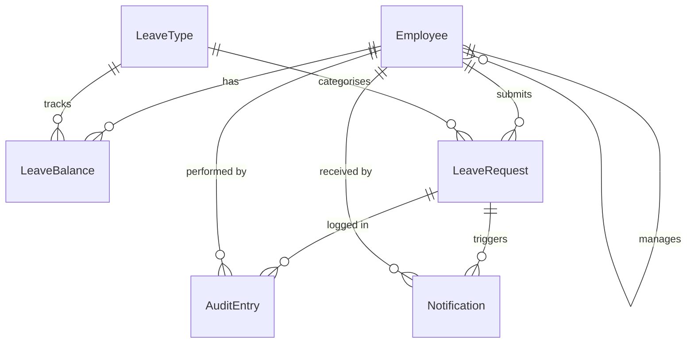

# Logical Data Model — Leave Management System

> **Source:** `ba/data-model/logical-data-model.json`

```mermaid
erDiagram
    Employee {}
    LeaveType {}
    LeaveBalance {}
    LeaveRequest {}
    AuditEntry {}
    Notification {}

    Employee ||--o{ Employee : "manages"
    Employee ||--o{ LeaveRequest : "submits"
    Employee ||--o{ LeaveBalance : "has"
    LeaveType ||--o{ LeaveRequest : "categorises"
    LeaveType ||--o{ LeaveBalance : "tracks"
    LeaveRequest ||--o{ AuditEntry : "logged in"
    LeaveRequest ||--o{ Notification : "triggers"
    Employee ||--o{ AuditEntry : "performed by"
    Employee ||--o{ Notification : "received by"
```
