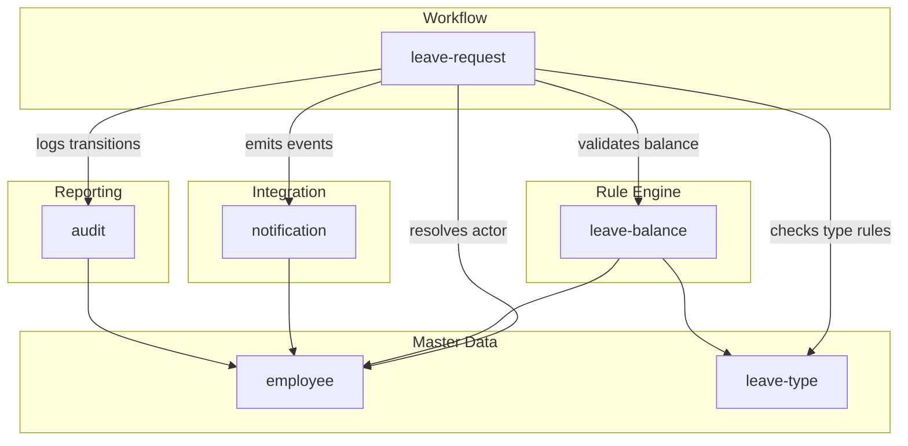
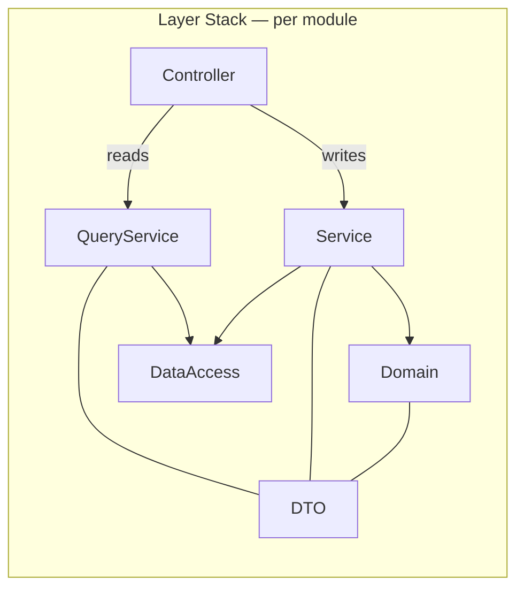
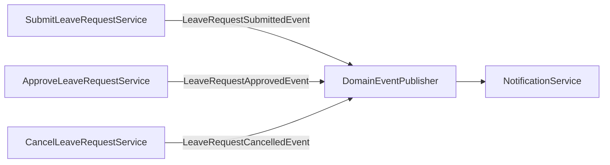

# Architecture Diagram — Leave Management System

> **Source:** `design/application_architecture.json`

## Module Architecture

```mermaid
graph TD
    subgraph workflow["Workflow"]
        LR[leave-request]
    end
    subgraph master_data["Master Data"]
        EMP[employee]
        LT[leave-type]
    end
    subgraph rule_engine["Rule Engine"]
        LB[leave-balance]
    end
    subgraph integration["Integration"]
        NOTIF[notification]
    end
    subgraph reporting["Reporting"]
        AUDIT[audit]
    end

    LR -->|validates balance| LB
    LR -->|checks type rules| LT
    LR -->|resolves actor| EMP
    LR -->|emits events| NOTIF
    LR -->|logs transitions| AUDIT
    LB --> EMP
    LB --> LT
    NOTIF --> EMP
    AUDIT --> EMP
```

## Layered Architecture

```mermaid
graph LR
    subgraph layers["Layer Stack — per module"]
        C[Controller]
        S[Service]
        QS[QueryService]
        D[Domain]
        DA[DataAccess]
        DTO[DTO]
    end

    C -->|writes| S
    C -->|reads| QS
    S --> D
    S --> DA
    QS --> DA
    D --- DTO
    S --- DTO
    QS --- DTO
```

## Shared Infrastructure

```mermaid
graph LR
    S1[SubmitLeaveRequestService]
    S2[ApproveLeaveRequestService]
    S3[CancelLeaveRequestService]
    PUB[DomainEventPublisher]
    NOTIF[NotificationService]

    S1 -->|LeaveRequestSubmittedEvent| PUB
    S2 -->|LeaveRequestApprovedEvent| PUB
    S3 -->|LeaveRequestCancelledEvent| PUB
    PUB --> NOTIF
```
