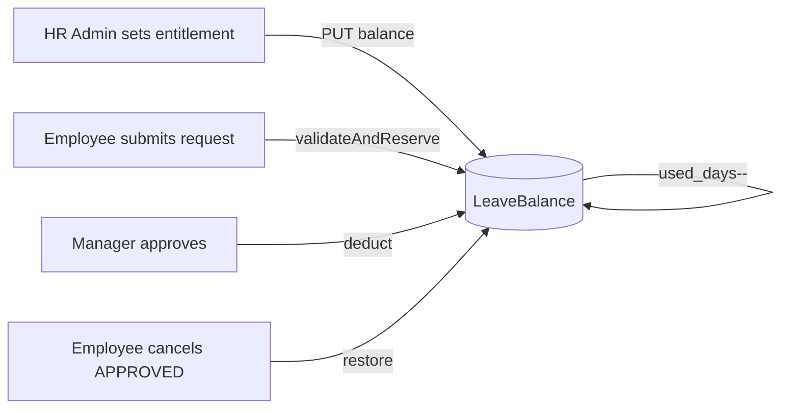
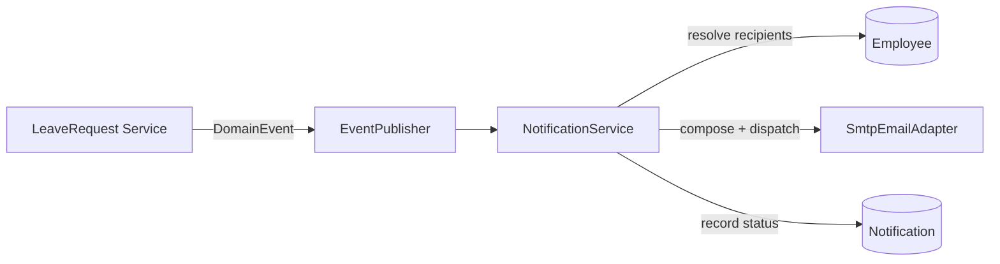
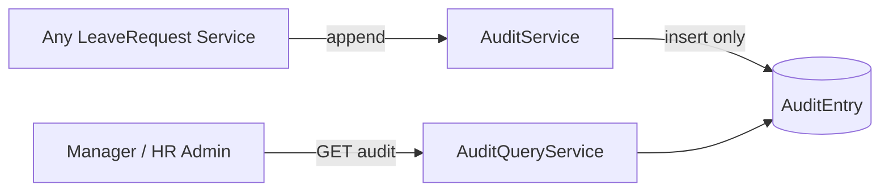

# Data Flow — Leave Management System

## Balance Lifecycle

```mermaid
flowchart LR
    SET[HR Admin sets entitlement] -->|PUT balance| LB[(LeaveBalance)]
    SUB[Employee submits request] -->|validateAndReserve| LB
    LB -->|pending_days++| LB
    APP[Manager approves] -->|deduct| LB
    LB -->|used_days++ / pending_days--| LB
    CAN[Employee cancels APPROVED] -->|restore| LB
    LB -->|used_days-- | LB
```

## Notification Data Flow

```mermaid
flowchart LR
    LR[LeaveRequest Service] -->|DomainEvent| PUB[EventPublisher]
    PUB --> NS[NotificationService]
    NS -->|resolve recipients| EMP[(Employee)]
    NS -->|compose + dispatch| EMAIL[SmtpEmailAdapter]
    NS -->|record status| NLOG[(Notification)]
```

## Audit Data Flow

```mermaid
flowchart LR
    SVC[Any LeaveRequest Service] -->|append| AS[AuditService]
    AS -->|insert only| ADB[(AuditEntry)]
    MGR[Manager / HR Admin] -->|GET audit| AQ[AuditQueryService]
    AQ --> ADB
```
