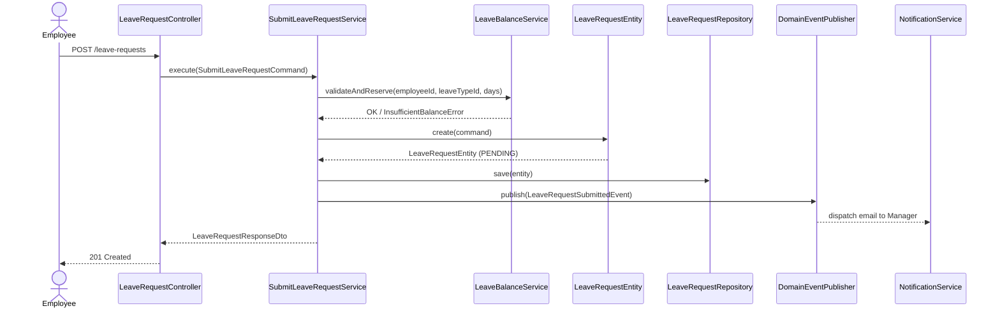
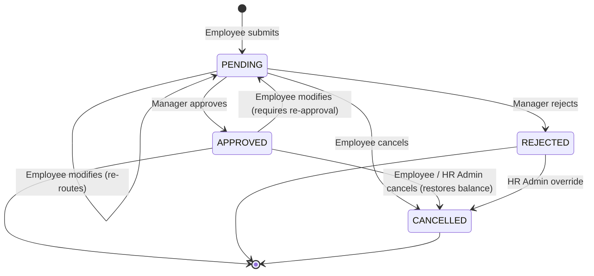

# Leave Request — Interaction Flow

## Submit Leave Request (UC-001)

```mermaid
sequenceDiagram
    actor Employee
    participant Controller as LeaveRequestController
    participant Service as SubmitLeaveRequestService
    participant LBSvc as LeaveBalanceService
    participant Domain as LeaveRequestEntity
    participant Repo as LeaveRequestRepository
    participant Pub as DomainEventPublisher

    Employee->>Controller: POST /leave-requests
    Controller->>Service: execute(SubmitLeaveRequestCommand)
    Service->>LBSvc: validateAndReserve(employeeId, leaveTypeId, days)
    LBSvc-->>Service: OK / InsufficientBalanceError
    Service->>Domain: create(command)
    Domain-->>Service: LeaveRequestEntity (PENDING)
    Service->>Repo: save(entity)
    Service->>Pub: publish(LeaveRequestSubmittedEvent)
    Pub-->>NotificationService: dispatch email to Manager
    Service-->>Controller: LeaveRequestResponseDto
    Controller-->>Employee: 201 Created
```

## Leave Request State Machine

```mermaid
stateDiagram-v2
    [*] --> PENDING : Employee submits
    PENDING --> APPROVED : Manager approves
    PENDING --> REJECTED : Manager rejects
    PENDING --> PENDING : Employee modifies (re-routes)
    PENDING --> CANCELLED : Employee cancels
    APPROVED --> PENDING : Employee modifies (requires re-approval)
    APPROVED --> CANCELLED : Employee / HR Admin cancels (restores balance)
    REJECTED --> CANCELLED : HR Admin override
    APPROVED --> [*]
    REJECTED --> [*]
    CANCELLED --> [*]
```
